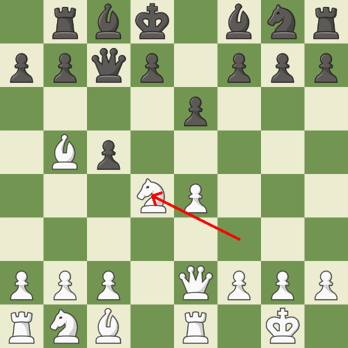
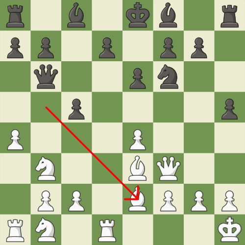
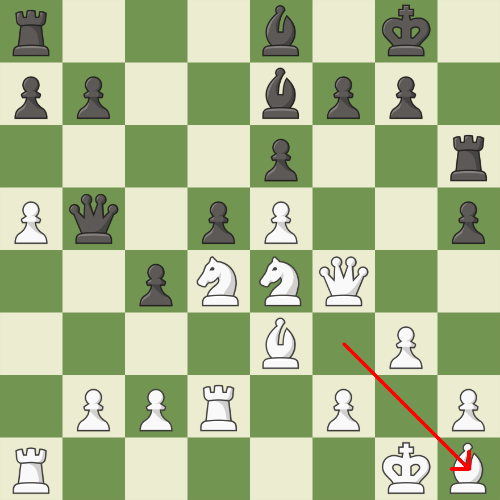
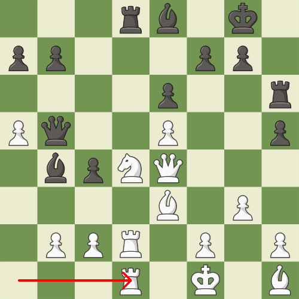
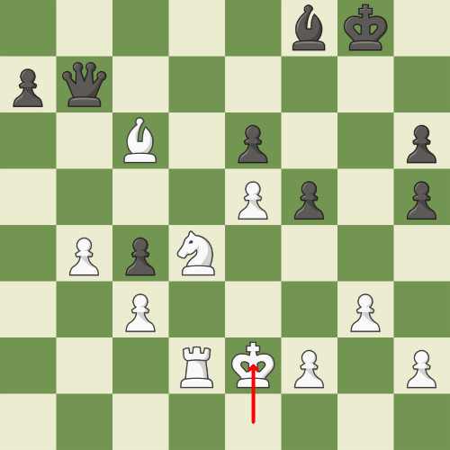
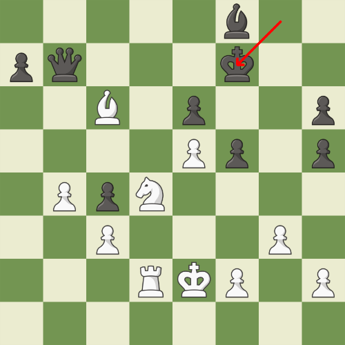
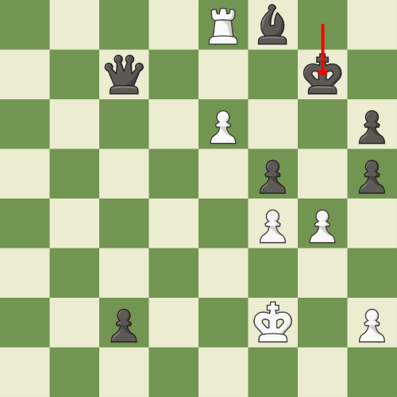
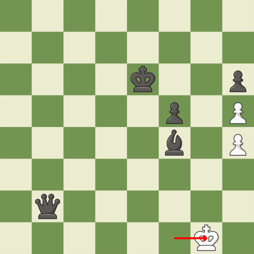

# Chess game

## Rules

Each player submits a string consisting of `p`, `n`, `b`, `r`, `q`, `k`. Each of the characters correspond to the chess pieces pawn, knight, bishop, rook, queen, and king. Then a chess game is started, and stockfish will play the best move automatically for you. But, there is one and only constraint: **you can only move the piece corresponding to the character**. If you can't move the piece for whatever reason, you move the piece corresponding to the next piece in the string. The string is repeated over and over until the game ends.

For example, if your string is `pnbqkr`, stockfish will move a pawn on the 1st move, a knight on the 2nd move, a bishop on the 3rd move, and so on.

* Castling is considered a king move.

## Running the game

Run `main.py`

```
python main.py
```

## Example game

* white: `pnbqkr`
* black: `pnbrqk`

Move (white)|Move (black)|Move (white)|Move (black)
:-:|:-:|:-:|:-:
|||
|||    
||| 
|||
|||
|||
|||
|||
|||
|||
|||
|||
|||
|||
|||
|||
|||
|||
|||
|||
|||
|||
|||
|||
|||
|||
|||
|||
|||
|||
|||
|||
|||
|||
|||
|||
|||
|||
|||
|||